# Логопед+
"Логопед+" - платформа для автоматизации работы логопед, решающая задачи организации логопедических занятий, проведения диагностики речи и упрощающая лечение речевых заболеваний.
### Функциональные возможности
- Централизованная авторизация для всех сервисов (Keycloak, роли: логопед, клиент)
- Управление пациентами и речевыми картами
- Система записи на занятия (индивидуальные, групповые)
- Микросервис уведомлений
- Отслеживание прогресса (динамика лечения, статистика, графики)
### Архитектура
- **Frontend**: SPA Angular client реализует UI в зависимости от роли взаимодействие с BFF через HTTP Client
- **Backend For Frontend (BFF)**: Spring boot сервис, обращается к Auth Server для получения JWT-токенов и формирования cookies для Frontned, авторизованные запросы (HTTP, WebSocket) перенаправляются в Backend
- **Auth Server**: Keycloak, Централизованная аутентификация и авторизация по протоколу OAuth 2.0
- **API Gateway**: Spring Cloud Gateway, единая точка входа, маршрутизация запросов к сервисам
- **Service Discovery**: Netflic Eureka Server, регистрация всех запущенных микросервисов для работы API Gateway
- **Resource Server**: Управление расписанием, пациентами, диагностикой для речевых карт
- **Notification microservice**: содержит Scheduled-задачи, которые периодически опрашивают БД, чтобы сгенерировать события уведомлений, которые отправляются в Frontend по Websocket 
- **База данных**: PostgreSQL, хранение данных, каждый сервис обращается к собственной БД
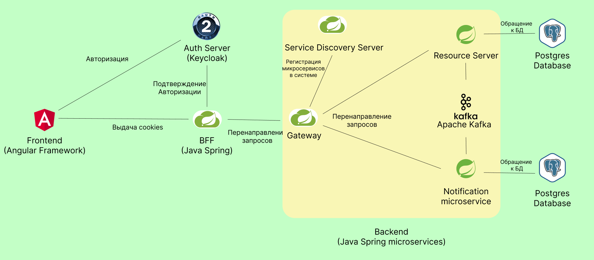
**Стек**: Java 17, Gradle, Spring, Hibernate, PostgreSQL, Apache Kafka, JUnit, Mockito, TypeScript, Angular, Keycloak, Docker.

### Запуск
Сформировать Docker образы по Dockefile, хранящиеся директориях сервисов
```
docker build Dockerfile -t logoped-be-deps
docker build Dockerfile -t sys-server
docker build Dockerfile -t sys-gateway
docker build Dockerfile -t rs-main
docker build Dockerfile -t ms-notification
docker build Dockerfile -t angular-logoped

после создания контейнера с keycloak скопировать secret в app.props
docker build Dockerfile -t bff-for-angular
```

Создать контейнеры исходя из docker-compose.yml
Запустить docker-compose
```
docker-compose up
```
Алтернативный способ запуска показан в релизе
### Демонстрация
#### Промо
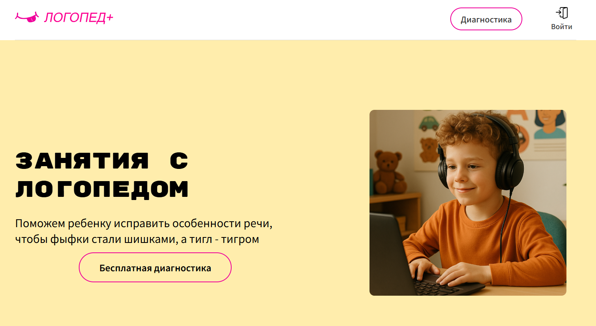
#### Авторизация через Keycloak
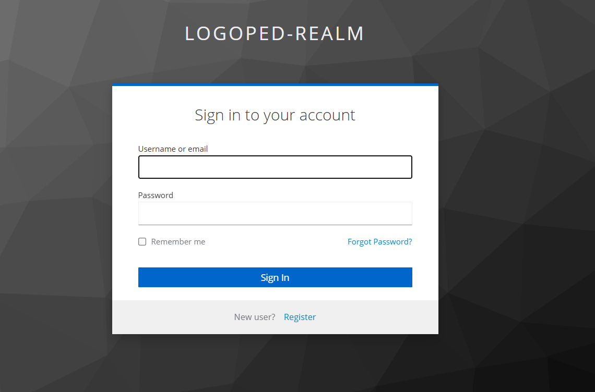
#### Управление пациентами Клиентом
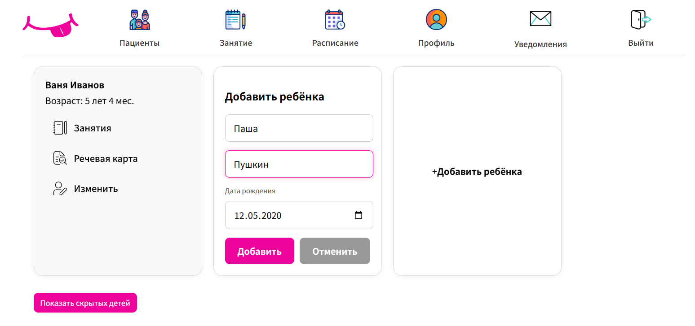
#### Занятия
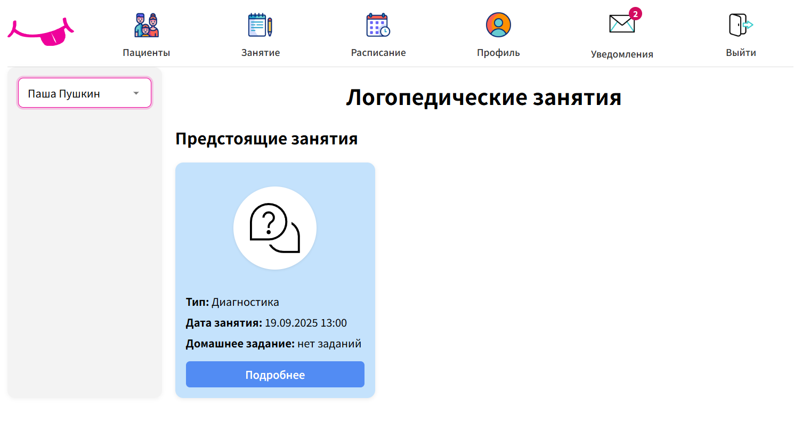
#### Расписание
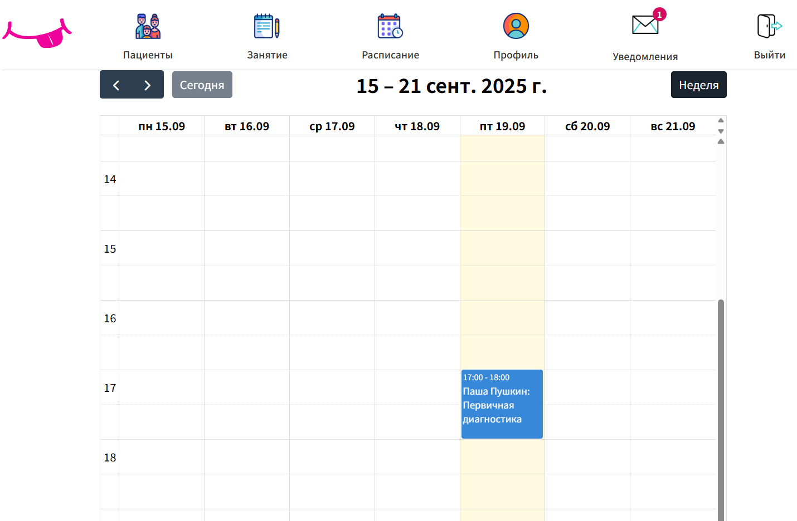
#### Уведомления
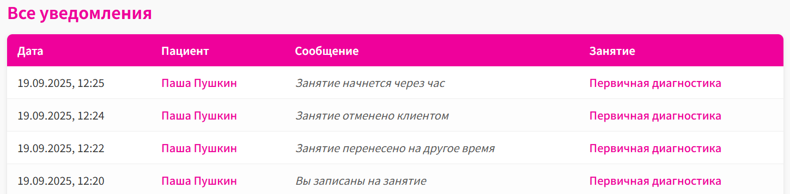
#### Статистика
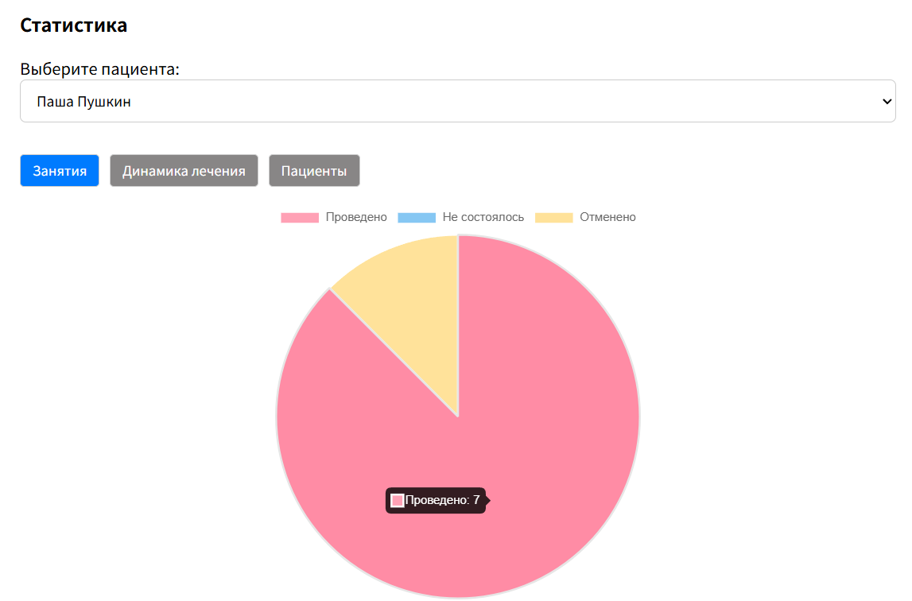
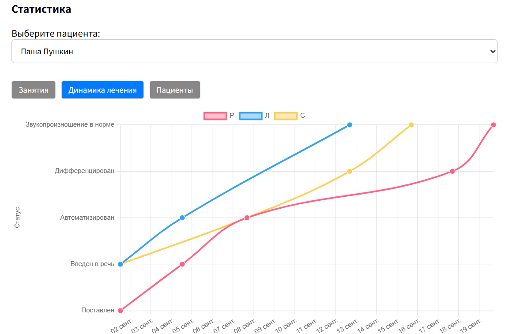
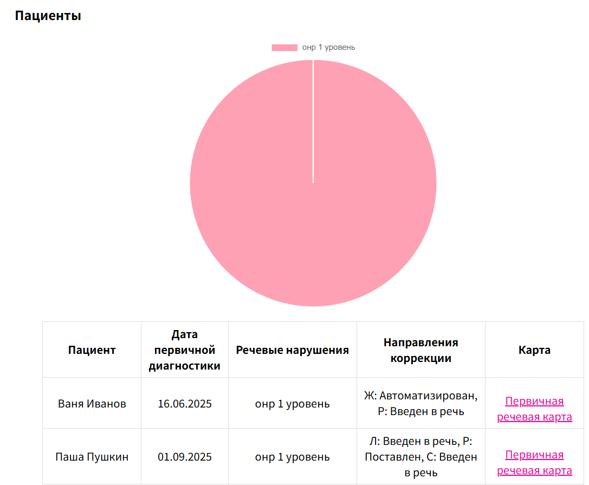
#### API
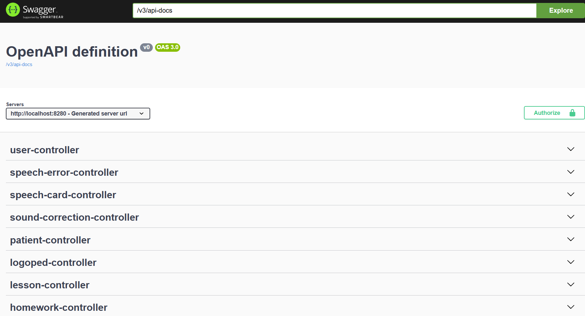
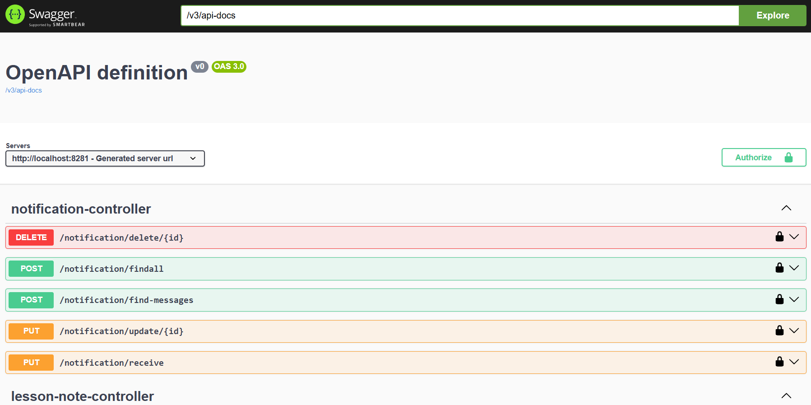

### Планы по развитию
- Организация видеозвонков для онлайн логопедических занятий
- Составление учебных планов
- Проведение занятий в очном формате
